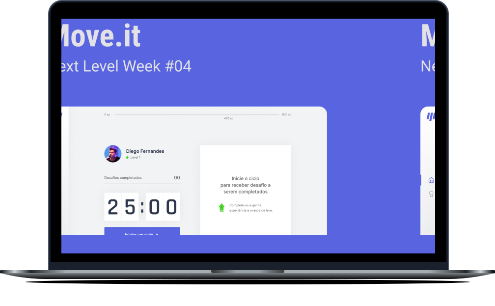

<h1 align="center">
  
</h1>

<p align="center">
  <a href="#-project">Project</a>&nbsp;&nbsp;&nbsp;|&nbsp;&nbsp;&nbsp;
  <a href="#-preview">Preview</a>&nbsp;&nbsp;&nbsp;|&nbsp;&nbsp;&nbsp;
  <a href="#-techs">Techs</a>&nbsp;&nbsp;&nbsp;|&nbsp;&nbsp;&nbsp;
  <a href="#-todo_list">Todo_List</a>&nbsp;&nbsp;&nbsp;|&nbsp;&nbsp;&nbsp;
  <a href="#-layout">Getting started</a>&nbsp;&nbsp;&nbsp;|&nbsp;&nbsp;&nbsp;
  <a href="#-layout">Layout</a>&nbsp;&nbsp;&nbsp;|&nbsp;&nbsp;&nbsp;
  <a href="#-license">License</a>
</p>

<p align="center">
  
  
       

  
</p>

<br>

<p align="center">
  
</p>

## 💻 Project

[Move.it](https://move-it-hedenica.vercel.app/) is a project that aims to remind its users
to always be exercising and moving! 💜 

This is a project developed during the **[Next Level Week](https://nextlevelweek.com/)**, presented by **[@Rocketseat](https://github.com/Rocketseat)** during February 22-28, 2021.

## 🔥 Preview

[](https://moveit-hedenica.vercel.app/)

## 🧪 Techs

This project was developed using the following techs:

- [Next.js](https://nextjs.org/)
- [React](https://reactjs.org)
- [TypeScript](https://www.typescriptlang.org/)
- [CSS Modules](https://github.com/css-modules/css-modules)

## 🗒 Todo_List

- [x] Light/Dark Mode
- [x] README
- [ ] Github Authentication
- [ ] Responsiveness
- [ ] Sidebar
- [ ] Leader board
- [ ] Update Modal Component

## 🚀 Getting started

Clone the project and access the folder

```bash
$ git clone https://github.com/hedenica/moveit-web.git && cd moveit
```

Follow the steps below
```bash
# Install the dependencies
$ yarn

# Start the project
$ yarn dev
```

## 🔖 Layout

You can view the project layout through the links below:

- [Layout Web](https://www.figma.com/file/ge20pu3ofMOKoliUyKx1Nl/Move.it-1.0) 

Remembering that you need to have a [Figma](http://figma.com/) account to access it.

## 📝 License

This project is licensed under the MIT License. See the [LICENSE](LICENSE.md) file for details.


---

<p align="center">Made with 💜 by Hedênica Morais</p>
